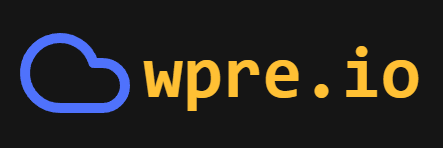

	

`wpre.io` is a weather preview web application built in [Vite](https://vitejs.dev/) with [React](https://react.dev/), using the [OpenMeteo API](https://open-meteo.com/), [TailwindCSS](https://tailwindcss.com/), [Lucide](https://lucide.dev/) and the [tz-lookup](https://github.com/photostructure/tz-lookup) package.

It works by asking for geolocalization permission, then with the data it requests some data from the API. 

### Features
- Persistent dark and light mode.
- Sun and Moon icons depending on the hour.
- Responsive design.
- No API keys required.
- Easy to read interface.
- Weather description, temperature, wind speed, rain chance and millimeters available.

### TODO
- <strike>Add hour checking and moon icon.</strike> 	<!--- Icon: 		https://lucide.dev/icons/moon -->
- Add meta OpenGraph tags. 		<!--- Reference: 	https://ogp.me/ -->
- Add mobile bar color customization. 	<!--- Documentation: 	https://developer.mozilla.org/en-US/docs/Web/HTML/Element/meta/name/theme-color -->
- Add help button.

    
    

